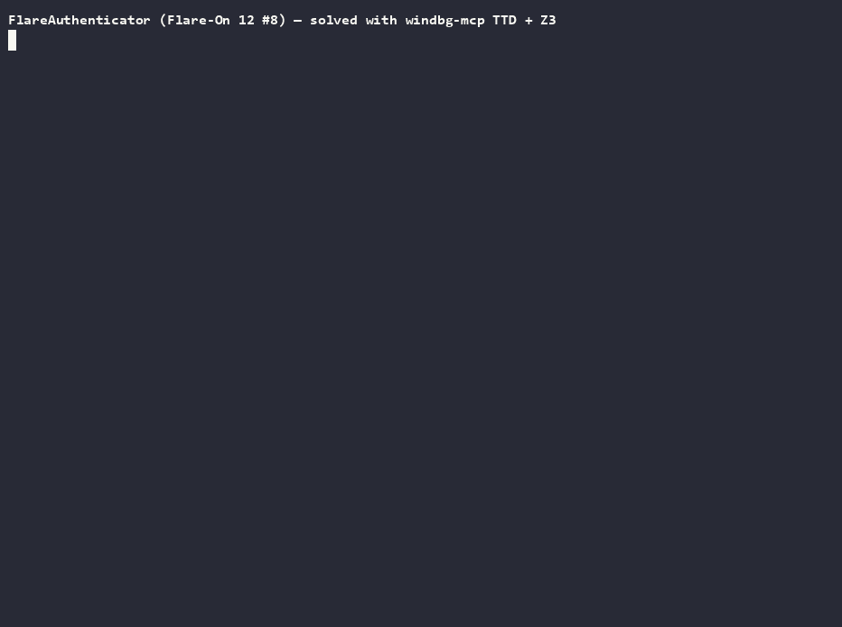

# Walkthrough: solving an obfuscated Qt crackme with TTD + Z3

An end-to-end solve of a real, heavily-obfuscated target — **`FlareAuthenticator.exe`** (Flare-On 12,
challenge 8) — driving **Time Travel Debugging through `windbg-mcp`**. It shows how the TTD tools turn
an opaque, anti-analysis-hardened binary into something you can *read*: record a run, navigate it
forward and backward, query it with the data model, recover the validation math, then hand the math to
an SMT solver (Z3) and read the flag back out of a trace.

The final flag is **`s0m3t1mes_1t_do3s_not_m4ke_any_s3n5e@flare-on.com`** — and the phrasing is the
designer's wink: the 25-digit code is deliberately **not unique**, so "solving" means satisfying a
constraint, not finding a secret. Z3 is exactly the right hammer.

Every tool call below is real and the outputs are the actual ones from the session (trimmed).



*(Recorded terminal session — source: [`flareauthenticator.cast`](flareauthenticator.cast),
`asciinema play`.)*

## 0. The target

A Qt 6 GUI: a **FLARE Authenticator** keypad — a 5×5 grid of digit cells plus a 0–9 pad with `DEL`/`OK`.
You enter a **25-digit** code; `OK` validates it. Wrong input pops a **"Failure / Wrong Password"**
`QMessageBox`; a correct code shows **"Success"** with the flag.

Two things make this a *TTD* problem rather than a *strings* problem:

- **No cleartext.** Scanning the `.exe` for `Wrong`, `Password`, `Failure`, `flare`, `Success` (ASCII
  and UTF‑16) returns **nothing** — the UI text is decrypted at runtime.
- **Anti-analysis guard.** Launched without the `QT_QPA_PLATFORM_PLUGIN_PATH` environment variable that
  its `run.bat` sets, the program refuses with a **"Execute run.bat instead."** message box and exits.

## 1. Record a trace

`record_trace` is the one-call wrapper (`TTD.exe -out … -launch …`), but it launches the target with
the server's environment, which lacks `QT_QPA_PLATFORM_PLUGIN_PATH` — so the guard trips. The fix is to
record under the **same environment `run.bat` establishes** (both drive the identical recorder):

```powershell
$env:QT_QPA_PLATFORM_PLUGIN_PATH = $dir            # what run.bat sets; defeats the guard
TTD.exe -accepteula -out $trace -launch "$dir\FlareAuthenticator.exe"
# …drive the GUI: type 25 digits, press OK, dismiss the dialog, close the app…
```

We record one run typing a known-wrong code `1234567890123456789012345` → **"Wrong Password"**. That one
failing run captures the whole validation, replayable in both directions.

## 2. Open, orient, and anchor on the decision

```text
open_trace { "path": "…\\801.run" }        → @$curprocess.TTD.Lifetime : [32:0, 11674:AB4]
modules {}                                  → FlareAuthenticator 00007ff6`5c150000 (no PDB); Qt6*, bcryptPrimitives…
```

The strongest anchor in a wrong run is the failure dialog. `ttd_calls` finds every call to a Win32/Qt
API across the whole trace; the message box is `QMessageBox::warning`, and its **return address lands in
the app**:

```text
dx { "expression": "-g @$cursession.TTD.Calls(\"Qt6Widgets!QMessageBox::warning\").Select(c => new { Time = c.TimeStart, Ret = c.ReturnAddress })" }
→ [0x0]  A134:188  0x7ff65c17a502          # RVA 0x2a502 — the OK handler's failure branch
```

## 3. The obfuscation, and the real check

Disassembling the OK handler shows every call target is computed at runtime
(`mov rax,[global]; add rax,<64-bit const>; call rax`) and a `uf` contains **no `cmp`/`jcc`** — control
flow is *flattened* through a state variable and computed `jmp rax`. Static tools stall here; TTD sees
the resolved targets.

The obfuscator marks every decision with `sete al`. Searching `.text` for the opcode (`0f 94 c0`) finds
~120 sites, but **two are structurally different** — they save the boolean to a local instead of feeding
the dispatch table. One of those is the real check:

```text
disassemble around RVA 0x21e3a:
  mov  rax,[rax+78h]                 ; rax = a 64-bit hash of the input
  mov  rcx, 0BC42D5779FEC401h        ; expected constant
  sub  rax,rcx
  sete al
  mov  [rbp+78Fh],al                 ; save pass/fail
```

Break there and read the operands live:

```text
set_breakpoint 0x7ff65c171e37 ; go
→ rax = 05b735c36628fcab   rcx = 0bc42d5779fec401     # my hash vs expected
```

## 4. Recover the hash math

`ttd_memory` write-watch on the hash slot shows it is written **25 times** (one per keystroke) by a
single instruction at RVA `0x16b00`. Disassembling that update, the obfuscated bit-ops simplify to plain
addition:

```text
h_new = h + a_i          where   a_i = Y_i * g( (i+1)*256 + '0' + d_i )
```

`Y_i` is a per-position weight, `X_i = (i+1)*256`, and `g` is a pseudo-random function of its argument
(sampling it gives `g(0x131)=6235f14, g(0x232)=806e2b, g(0x333)=e616e02, …` — non-linear). A live test
proves **`g` ignores the running hash** (corrupt `h`, re-evaluate `g` → identical), so the accumulation
is a clean **pure sum**:

```text
hash = Σ_{i=0..24}  Y_i * g( (i+1)*256 + '0' + d_i )  ≡  0x0bc42d5779fec401   (mod 2^64),   d_i ∈ [0,9]
```

## 5. Extract the constants (TTD replay + debugger function-evaluation)

- **`Y_i` (25 values)** — read `[rbp+3C0h]` at each per-keystroke addend site by reverse-continuing to
  it in the replay (`bp 0x16776; g-`). `X_i` in the same frame confirms position order.
- **`g` at all 250 args** — replay is immutable, so switch to a **live** session (`attach_process`) and
  *evaluate the function*: at the `g` call site, set `rax=g`, `rcx=hasher`, `rdx=arg`, `rip=callsite`,
  run past the call, read `rax`. A scripted `.for` loop over `(i+1)*256 + '0' + d` dumps all 250 values
  (logged to a file with `.logopen`). The live `g(0x131)=6235f14` matches the replay — cross-checked.

## 6. Offload to Z3

The constraint is a textbook bitvector problem. Using `z3-solver` (WASM) in Node:

```js
// hash = Σ Y[i] * g[i][d_i]  ==  target   (BitVec 64);   d_i ∈ [0,9]
const total = positions.reduce((acc,i) => acc.add(
  ites(d[i], v => B((Y[i]*g[i][v]) & MASK))), B(0n));
solver.add(total.eq(B(0x0bc42d5779fec401n)));
await solver.check();          // sat
```

```text
sanity: my hash = 5b735c36628fcab / expected 5b735c36628fcab OK   # model validated against the wrong run
z3: sat
SOLUTION: 4498291314891210521449296
verify hash = bc42d5779fec401 / target bc42d5779fec401 OK
```

That single 64-bit equation is **under-determined** (~2¹⁹ codes satisfy it) — there is no unique
password. Any solution will do.

## 7. Read the flag

Record a fresh trace typing the Z3 code, then travel to the success dialog and read its text QString:

```text
open_trace { … }
dx { "expression": "@$cursession.TTD.Calls(\"Qt6Widgets!QMessageBox::information\").First().TimeStart" }   → A5D1:19C8
goto_position { "position": "A5D1:19C8" }
execute { "command": "du poi(@r8+8)" }
```

```text
00000146`12b6ce40  "Here is your pass:.s0m3t1mes_1t_"
00000146`12b6ce80  "do3s_not_m4ke_any_s3n5e@flare-on"
00000146`12b6cec0  ".com"
```

**`s0m3t1mes_1t_do3s_not_m4ke_any_s3n5e@flare-on.com`** — the flag is keyed off the hash *value* (equal
to the target for every satisfying code), so *any* Z3 solution unlocks it. "Sometimes it does not make
any sense" indeed.

> The self-consistency matters: forcing the check to pass by patching the hash byte *after the fact*
> (`eq <hash slot> <target>`) yields a **garbled** flag, because the flag key is derived from the same
> accumulation and the patch desynchronizes it. A genuine satisfying code keeps everything consistent.

## Tool cheat sheet

| Goal | Tool(s) |
|------|---------|
| Record past an env guard | `record_trace` / `TTD.exe` with the target's env set |
| Find the failure & its in-app caller | `ttd_calls("Qt6Widgets!QMessageBox::warning")` → `ReturnAddress` |
| Read obfuscated code / resolve computed calls | `disassemble`, `execute { "u …" }`, `? poi(global)+const` |
| Read the compared operands live | `set_breakpoint` + `go` + `registers` |
| Prove the accumulation is a pure sum | `ttd_memory { mode:"w" }` on the hash slot; `dx … .Where(TimeStart.Sequence …)` |
| Pull per-position constants | `bp` at the addend site + `g-` (reverse-continue) across the replay |
| Evaluate a pure function at many inputs | live `attach_process`, set `rax/rcx/rdx/rip`, run past the call, read `rax` in a `.for` loop |
| Solve the constraint | `z3-solver` (WASM) in Node — `Σ Y[i]*g[i][d_i] == target` over BitVec(64) |
| Read the flag | fresh trace of a solution → `goto_position` the `information` call → `du poi(@r8+8)` |

## Pitfalls (learned the hard way)

- **Never run an unbounded memory search on a TTD trace.** `s -u 0 L?0x400000000000 …` sends the engine
  into a multi-minute scan, and every later call to that session queues behind it. **Scope every search**
  to a real region (a module range, a heap segment from the PEB `ProcessHeaps`, a stack window), and
  prefer `ttd_calls`/`ttd_memory` over raw `s`. `execute` is on the bounded path, so a scan that runs
  away self-aborts rather than pinning the session indefinitely, and only that session is affected.
- **`registers` can read empty at a module-load break** — use `execute { "r rip" }` and travel to a
  settled position before relying on context.
- **The WinDbg `.for` radix bites.** With the default radix `10` means `0x10`; write loop bounds
  explicitly (`@$t5<0xa`).
