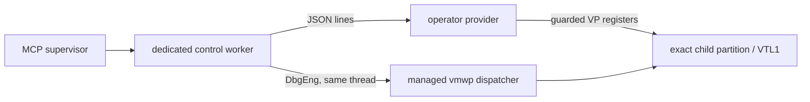
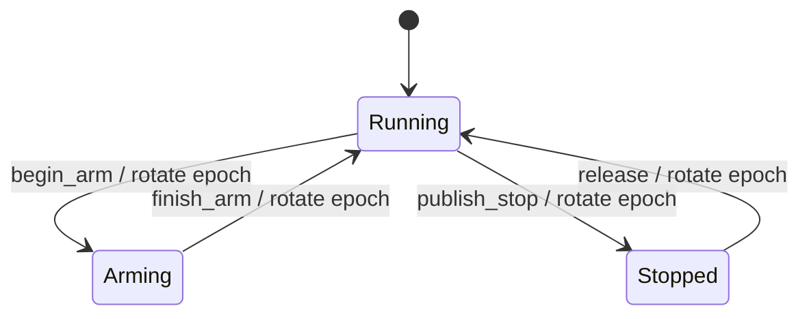

# Live VTL1 control provider contract

`src/skcontrol.rs` defines the repository-owned half of the live Secure Kernel control boundary.
The operator supplies the privileged provider as a child process. The repository ships no driver,
private VID layout, or provider DLL.

`--sk-control-probe` validates a provider's startup identity, epoch, and capabilities.
`src/sklive.rs` supplies the worker-side state machine over that contract, and `src/skdispatch.rs`
supplies the build-guarded `vmwp` adapter. The opt-in `--sk-live-control` role runs the complete
narrow acceptance lifecycle through the same engine constructor and thread ownership as an engine
worker. The same state machine is also exposed as a separate MCP session kind whose worker owns
the provider, adapter and DbgEng attachment.

## Process boundary

The provider owns exact-partition VTL1 register access. It does not receive or complete VID
messages. The debugger owner attaches to the existing `vmwp`, observes the dispatcher holding the
exception, and publishes that event to the provider. This keeps the private provider out
of the MCP supervisor and leaves Windows' existing VM process responsible for boot, devices,
message receipt, and native completion.



The provider process starts with an exact target fixed by operator configuration. It prints:

```text
windbg-mcp-sk-control/2
{"protocol":2,"target":{...},"epoch":"running-..."}
```

Each provider target contains the VM GUID, hypervisor partition ID, VP, VTL, and expected CR3.
Every request and response repeats that target and the current opaque epoch. A session may own one
provider per selected VP; their VM, partition, VTL and CR3 coordinates must agree.

Provider stdout is read on a dedicated non-DbgEng thread. Each complete protocol line has a
10-second deadline, including the startup banner and hello, so a provider which remains alive but
stops answering cannot pin the worker's engine thread indefinitely. EOF is reported immediately.

## Epoch state machine



Register access is legal only in `Arming` or `Stopped`. `Arming` is entered while the debugger has
already paused the disposable VM and is installing or clearing DR state. `Stopped` requires a held
dispatcher event. A provider must refuse register access in `Running`, a stale epoch, a different
target, an unsupported register, and any compare guard which no longer matches.
Every successful transition must issue a token that has never appeared earlier in that provider
session; returning to an older non-adjacent token is a protocol fault, not a valid rotation.
These provider-local epochs remain inside the worker. The multi-VP controller issues a separate,
monotonic session epoch for each public running or stopped transition. Each controller instance
also carries a 256-bit nonce from the Windows system RNG, so equal epoch strings from two provider
processes or two concurrent MCP sessions cannot authorize a replay against another VP or VM.

The first revision has seven capabilities:

- `begin_arm` and `finish_arm` bracket debugger-paused breakpoint setup;
- `publish_stop` records the exact vector-1 event observed by the debugger worker;
- `held_event` reads that immutable event identity back;
- `read_registers` returns named values and per-register hypervisor status;
- `write_registers` compares every named register before applying any replacement;
- `release` consumes one held epoch immediately before the worker completes that event through
  `vmwp`'s native path.

The ordering on the last operation is load-bearing. Once native completion runs, the next vector-1
event may arrive immediately, so the provider must already accept a new `publish_stop`. The worker's
outer state machine remains in `releasing` between the provider transition and native completion;
failure in that interval faults the session and runs bounded recovery.

The readable bank is `rip`, `rsp`, `rflags`, `cr3`, `cs`, `dr0` through `dr3`, `dr6`, `dr7`, and
`vsm_vp_status`. `cr3`, `cs`, and `vsm_vp_status` are read-only. A held event records message type,
vector, VP, VTL, CPL, dispatcher context, advance flag, and an unclassified debug-exception reason.
The worker reads DR6 only after publication and reports the validated hardware slot or single-step
cause in the MCP stop record. Revision 2 accepts only mapped exception type `0x01000002`, vector 1,
a selected VP at VTL1 CPL0, a nonzero dispatcher context, and native advance clear.

Revision 2 changes the `publish_stop` event reason from the already-classified v1 hardware or step
cause to `debug_exception`. This is an intentional incompatible revision: a v1 provider is refused
at its ready banner instead of receiving a value outside its declared event schema.

## Probe

Run the non-mutating capability probe with an operator provider command:

```pwsh
windbg-mcp --sk-control-probe `
  --transport "python C:\private\provider.py ..." `
  --vm-id <VM-GUID> `
  --partition-id 0x85 `
  --expected-cr3 0x1201000
```

The optional `--vp` defaults to zero; VTL is fixed to 1 in this protocol revision. The command
starts before the MCP runtime and loads no DbgEng engine. It requires the operator's expected target
and rejects a provider hello for any other valid target. It prints the validated identity, current
epoch, and capabilities, then closes the provider's stdin and gives it ten seconds to exit before
terminating it.

Offline tests drive the complete running → arming → running → stopped → running sequence through a
fake provider, including guarded register reads and writes. They also pin fixed-width address
encoding, running-state refusal, target validation, and the rule that every state transition must
issue a session-unique epoch. A live acceptance still requires the disposable Hyper-V target and
the operator-supplied provider.

## Worker state machine

`src/sklive.rs` joins one or more VP-bound providers to one debugger-owned dispatcher. It contains no DbgEng engine
and no private VID layout; its owner is the existing engine worker, on the thread which created
that worker's engine. The dispatcher boundary must return the exact registered
callback context, a bounded observation of the held event, and a second read of the guarded guest
instruction.

The state machine implements both the narrow redirected gate and natural control-flow stepping:

1. pause the disposable target and enter the provider's arming epoch;
2. save RIP, RSP, RFLAGS, CR3, CS, DR0–DR3, DR6, DR7 and VSM VP status on every selected VP;
3. refuse an already-enabled hardware breakpoint and install one to four distinct execution
   breakpoints on every selected VP;
4. in `redirect` mode move RIP to the guarded instruction; in `natural` mode leave RIP untouched
   and require TF and RF to have been clear;
5. accept only the registered dispatcher context, a native event from the selected VP set, VTL1
   CPL0 vector 1, the bound CR3, one exact armed DR6 slot, and two identical held-state reads. The
   native intercept holds the winning VP, so explicitly pause the whole VM before restoring every
   non-winning VP and exposing the stop;
6. consume each stop epoch once to arm TF. The first step may reuse the hardware-stop instruction;
   every later step must re-prove the exact current instruction bytes. A step accepts one default
   fall-through address or at most four explicit destinations for a branch;
7. accept a single-step only with DR6.BS set, TF still set in the held state, RF clear, and RIP in
   that bounded destination set;
8. restore and verify the debug-register baseline and the baseline TF/RF bits. Redirect mode also
   restores the original RIP, RSP and ordinary flags; natural mode preserves guest execution
   progress. Finally rotate the provider to running and complete only the exact owned native event.

Its outer phases are `running`, `arming`, `stopped`, `releasing`, `faulted`, and `closed`. A stale
epoch is a refusal with no mutation. A changed instruction, unexpected stop reason, changed
callback context, unstable held state, provider failure, or native-completion failure enters the
terminal `faulted` phase. Recovery first tries to restore the saved register state. It authorizes
native completion only when both restoration and event ownership are proven; otherwise the adapter
must leave the disposable target paused. Conservative pause ownership means a resume may be owed;
it does not authorize provider writes. If the whole-VM pause barrier fails or times out, recovery
first finishes any pending resume and retries `Suspend-VM`. It restores provider baselines only
after that pause completes successfully; otherwise it leaves every baseline untouched and contains
the session with any native event incomplete.
Teardown does not erase the fault record.

The offline state-machine tests cover redirected and natural hardware stops, repeated and
branching steps, stale epochs, instruction-guard failure, wrong callback context, unstable held
registers, dispatcher timeout, provider death, debugger loss, target identity change, build-guard
failure, completion failure, stopped close, restoration, containment, and idempotent close. The
provider transport tests also pin bounded silence and reader death.

## MCP live-control session

The `securekernel` tool group exposes a selected VP set through one worker-owned live session. The
adapter pauses the whole disposable VM while it changes their state:

1. `open_sk_live_control` binds the exact VM, partition, primary VP, CR3, `vmwp` PID, dispatcher
   pointer, profile and provider commands. `additional_vps` adds VP numbers; in that form
   `control_transport` contains a `{vp}` placeholder used to start one identity-bound child per VP.
   A session accepts at most 16 providers in total. Opening does not pause the VM or install a
   breakpoint.
2. `sk_live_arm` re-reads each exact instruction, saves every selected VP's writable baseline and
   installs one to four explicitly slotted execution breakpoints. Redirect mode requires one VP
   and one breakpoint. Natural mode arms the full VP and breakpoint set.
3. `sk_live_wait` pumps `vmwp` until any selected VP reaches any armed address, re-establishes a
   VM-wide pause barrier, restores all losing VPs, and returns the winner, exact DR slot and complete
   stop evidence with a fresh controller epoch.
4. `sk_live_registers` and `sk_live_read_memory` inspect only that stopped epoch. The memory path
   uses the bound VTL1 CR3 and refuses an unmapped range whole.
5. `sk_live_step` consumes the stopped epoch once, clears the hardware breakpoint and arms TF.
   It may be repeated from any owned stop. Each later step supplies the exact current instruction;
   the next wait accepts only the supplied bounded destination set.
6. `sk_live_continue` consumes that new epoch, restores and verifies the complete baseline, clears
   execution control and completes the owned event. The session can then be armed again.
7. `end_session` restores any held state, removes the handler and scratch allocation, and performs
   the handled `vmwp` detach.

Ordinary debugger and capture operations are refused on this session: its DbgEng target is the
host `vmwp`, while its answers describe the guest VTL1. Conversely, the live operations are
refused on every other session kind. Mutating stopped operations require the exact opaque epoch,
so a stale or replayed step/continue request is rejected before mutation, including when a later
stop was won by another selected VP.

Teardown is fail closed. The supervisor does not terminate a worker when restoration, handler
cleanup and handled detach were not confirmed; the session moves to `live_control_unresolved` and
admits another teardown attempt only. If the supervisor disappears, the worker performs the same
cleanup itself and remains resident if it cannot prove it. Once adapter cleanup succeeds, a later
failure ending the worker's idle image target cannot relabel the proved VTL1 release as unresolved.

The opt-in smoke test reads all machine-specific inputs from `WINDBG_MCP_SMOKE_SK_LIVE`, whose JSON
must explicitly say `"disposable": true`. It drives the seven calls above through the built MCP
binary. The profile, privileged provider and bench evidence remain outside version control.

On 2026-10-03 that MCP test completed the full bind, arm, stop, inspect, step, second-stop,
continue and close lifecycle against the allowlisted disposable K3 VM. An independent wrapper then
observed the same `vmwp` PID and a healthy advancing heartbeat for 60 seconds, found no scoped crash
record, verified the guarded Secure Kernel bytes were unchanged, and confirmed that the VM was Off.

The natural-flow gate then armed `securekernel!KiTimerInterrupt` without changing RIP. It reached
the breakpoint through the initialized Secure Kernel's own execution and stepped 16 guarded
instructions, including register, stack, memory and conditional-branch instructions. Each step
verified the current bytes before mutation; the conditional branch admitted only its fall-through
and taken destinations. Continue preserved the progressed RIP, RSP and ordinary flags while
restoring the saved debug registers and TF/RF bits. The independent 60-second audit passed.

The multi-VP gate ran the same session on VP1 of a two-vCPU K3 boot. The exact-build profile reads
the native vector-event VP field, and the dispatcher ignored any event that did not report the
selected VP. VP1 stopped and stepped over the guarded Secure Kernel NOP while the adapter's VM-wide
pause kept both VPs stable. The independent audit found VP0's debug registers unchanged, VP1's
baseline restored, TF/RF clear on both VPs, unchanged guest text, the same healthy `vmwp`, and no
scoped crash record. A preceding natural-flow VP1 attempt timed out because that interrupt was not
scheduled there; bounded recovery restored the baseline and resumed the VM before faulting the
session.

The later fan-out implementation removes that single-VP session limit: one worker owns several
VP-bound providers, arms the same guarded slot set on each, accepts the first selected VP reported
by the native event, and restores every losing VP before returning the stop. Offline tests cover a
VP1 win with VP0 restoration. A multi-provider live run remains required before treating this
broader mode as bench-proven; the earlier live result proves selected VP1, one provider at a time.

Two more runs from fresh differencing children repeated the 16-instruction natural-flow lifecycle
and independent 60-second audit at new partition IDs and Secure Kernel bases. A live wrong-build
injection then changed the profiled `vmwp` SHA: the adapter refused before provider mutation,
resumed the guest, and left the debug registers, TF/RF and guest text unchanged.

A provider-death injection exited immediately before acknowledging `publish_stop`. The wait
returned a terminal fault with `target_left_paused=true`; `end_session` reported
`recovery_required=true`, `released=false` and retained the exact worker. An independent provider
read found DR0 still armed at the owned `KiTimerInterrupt` address and the guarded text unchanged.
Because the dead provider could no longer restore that state, the dedicated failure child was
discarded after evidence capture; ending the unresolved debugger replaced `vmwp`, as expected for
an unhandled DbgEng detach, before the replacement boot was stopped. This proves containment, not
recovery or continued guest health after provider loss.

## Build-guarded dispatcher adapter

`src/skdispatch.rs` implements the concrete K4.2b boundary without constructing another engine.
The opt-in role calls the engine constructor in `worker.rs`; every adapter call then borrows that
engine on the same thread. Its retained state owns the provider child, live-memory transport,
breakpoint ids, callback scratch allocation, handler context, VM pause state, and delayed completion
helper.

The profile input may be one JSON file or a directory containing at most 128 total entries. JSON
entries are treated as profiles; other entries count toward the enumeration bound and are ignored. A
directory must have exactly one entry whose declared `vmwp.exe` path and SHA-256 match the current
local image; the adapter repeats the identity check against DbgEng's loaded module before mutation.
Each profile contains an absolute `vmwp.exe` image path, SHA-256 and SizeOfImage;
function and stop-site RVAs; original bytes for every software-breakpoint site; exact-build event
context, event-VP and native-advance offsets; bounded scratch offsets; and no debugger command
text. The per-boot VND pointer is a separate session input. Before mutation the adapter checks the
VM GUID against the `vmwp` command line, the image identity, every guarded site, the current VTL1
CR3, and the selected Secure Kernel instruction. It refuses an existing mapping at the requested
scratch base or a pre-existing breakpoint at an owned site.

All debugger commands are fixed internal operations with validated numeric substitutions. Software
breakpoints are created and removed through the typed DbgEng API, and their original bytes are read
back after removal. The adapter uses `.detach /h` at the pending native breakpoint, because the
measured unhandled detach terminates `vmwp`. The delayed `Suspend-VM` completion kick runs on a host
helper thread and makes no DbgEng call; the engine itself never leaves its owner thread.

The CLI acceptance role performs one guarded hardware stop, one trap-flag step, continue, handler
unregister, deferred cleanup, scratch free, and handled detach. The MCP session extends that narrow
role with natural arming and repeated guarded steps. On 2026-10-03 the redirected one-VP gate passed
twice, the 16-instruction natural-flow gate passed, and the selected-VP gate passed on VP1 of a
two-vCPU boot. Their independent audits kept the same `vmwp` PID and healthy heartbeat for 60
seconds, found no scoped crash record, re-read unchanged Secure Kernel text, restored the selected
VP's debug state, and left the VM Off. The exact profile, provider, commands and evidence remain
ignored under `target/private/`.
