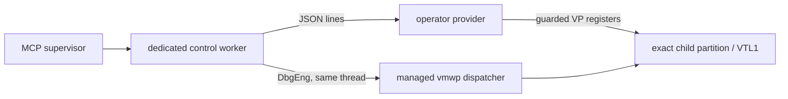
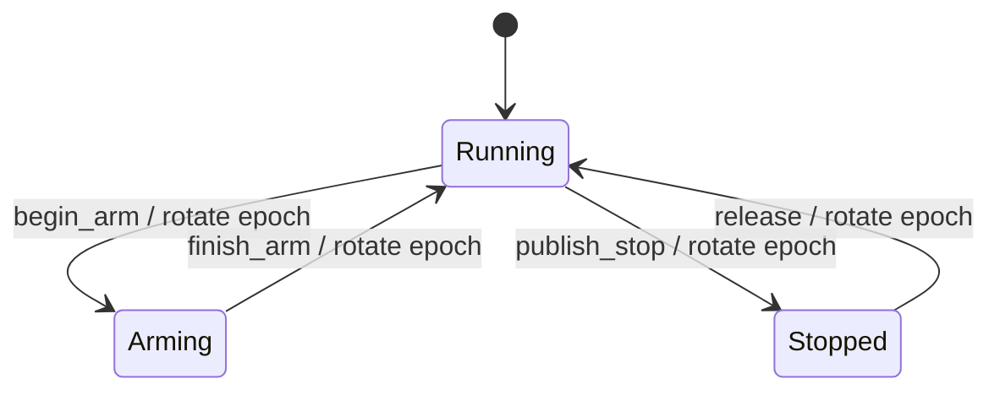

# Live VTL1 control provider contract

`src/skcontrol.rs` defines the repository-owned half of the live Secure Kernel control boundary.
The operator supplies the privileged provider as a child process. The repository ships no driver,
private VID layout, or provider DLL.

This is an implementation boundary, not an MCP session yet. `--sk-control-probe` validates a
provider's startup identity, epoch, and capabilities. `src/sklive.rs` now supplies the worker-side
state machine over that contract. The build-specific `vmwp` dispatcher adapter and MCP tools remain
later gates.

## Process boundary

The provider owns exact-partition VTL1 register access. It does not receive or complete VID
messages. A dedicated debugger worker will attach to the existing `vmwp`, observe the dispatcher
holding the exception, and publish that event to the provider. This keeps the private provider out
of the MCP supervisor and leaves Windows' existing VM process responsible for boot, devices,
message receipt, and native completion.



The provider process starts with an exact target fixed by operator configuration. It prints:

```text
windbg-mcp-sk-control/1
{"protocol":1,"target":{...},"epoch":"running-..."}
```

The target object contains the VM GUID, hypervisor partition ID, VP, VTL, and expected CR3. Every
request and response repeats the full target and current opaque epoch. Addresses are fixed-width
hex strings so JSON implementations cannot round 64-bit values.

## Epoch state machine



Register access is legal only in `Arming` or `Stopped`. `Arming` is entered while the debugger has
already paused the disposable VM and is installing or clearing DR state. `Stopped` requires a held
dispatcher event. A provider must refuse register access in `Running`, a stale epoch, a different
target, an unsupported register, and any compare guard which no longer matches.

The first revision has seven capabilities:

- `begin_arm` and `finish_arm` bracket debugger-paused breakpoint setup;
- `publish_stop` records the exact vector-1 event observed by the debugger worker;
- `held_event` reads that immutable event identity back;
- `read_registers` returns named values and per-register hypervisor status;
- `write_registers` compares every named register before applying any replacement;
- `release` consumes one held epoch immediately before the worker completes that event through
  `vmwp`'s native path.

The ordering on the last operation is load-bearing. Once native completion runs, the next vector-1
event may arrive immediately, so the provider must already accept a new `publish_stop`. The worker's
outer state machine remains in `releasing` between the provider transition and native completion;
failure in that interval faults the session and runs bounded recovery.

The readable bank is `rip`, `rsp`, `rflags`, `cr3`, `cs`, `dr0` through `dr3`, `dr6`, `dr7`, and
`vsm_vp_status`. `cr3`, `cs`, and `vsm_vp_status` are read-only. A held event records message type,
vector, VP, VTL, CPL, dispatcher context, advance flag, and either a hardware-breakpoint slot or a
single-step reason. Revision 1 accepts only mapped exception type `0x01000002`, vector 1, the bound
VP at VTL1 CPL0, a nonzero dispatcher context, and native advance clear.

## Probe

Run the non-mutating capability probe with an operator provider command:

```pwsh
windbg-mcp --sk-control-probe `
  --transport "python C:\private\provider.py ..." `
  --vm-id <VM-GUID> `
  --partition-id 0x85 `
  --expected-cr3 0x1201000
```

The optional `--vp` defaults to zero; VTL is fixed to 1 in this protocol revision. The command
starts before the MCP runtime and loads no DbgEng engine. It requires the operator's expected target
and rejects a provider hello for any other valid target. It prints the validated identity, current
epoch, and capabilities, then closes the provider's stdin and gives it ten seconds to exit before
terminating it.

Offline tests drive the complete running → arming → running → stopped → running sequence through a
fake provider, including guarded register reads and writes. They also pin fixed-width address
encoding, running-state refusal, target validation, and the rule that every state transition must
rotate the epoch. A live acceptance still requires the disposable Hyper-V target and the
operator-supplied provider.

## Worker state machine

`src/sklive.rs` joins one provider to one debugger-owned dispatcher. It contains no DbgEng engine
and no private VID layout; its production owner will be the existing engine worker, on the thread
which created that worker's engine. The dispatcher boundary must return the exact registered
callback context, a bounded observation of the held event, and a second read of the guarded guest
instruction.

The first revision deliberately implements the narrow gate that passed live:

1. pause the disposable target and enter the provider's arming epoch;
2. save RIP, RSP, RFLAGS, CR3, CS, DR0–DR3, DR6, DR7 and VSM VP status;
3. refuse an already-enabled hardware breakpoint, install one DR0 execution breakpoint, and
   redirect RIP to one guarded 1–15-byte instruction;
4. accept only the registered dispatcher context, VTL1 CPL0 vector 1, the bound CR3, the expected
   DR6 cause, and two identical held-state reads;
5. consume the stop epoch once to arm TF, then accept the single-step only at the guarded
   instruction's successor;
6. restore the complete writable baseline, verify the complete snapshot, rotate the provider to
   running, and complete only the exact owned native event.

Its outer phases are `running`, `arming`, `stopped`, `releasing`, `faulted`, and `closed`. A stale
epoch is a refusal with no mutation. A changed instruction, unexpected stop reason, changed
callback context, unstable held state, provider failure, or native-completion failure enters the
terminal `faulted` phase. Recovery first tries to restore the saved register state. It authorizes
native completion only when both restoration and event ownership are proven; otherwise the adapter
must leave the disposable target paused. Teardown does not erase the fault record.

The offline state-machine tests cover hardware stop to step to continue, stale epochs, instruction
guard failure, non-owned callback context, unstable held registers, completion failure, stopped
close, restoration, and idempotent close. The remaining adapter must supply an exact-build profile
for the private `vmwp` registration and completion sites and pass the same lifecycle on the
allowlisted disposable VM before this becomes an MCP session.
